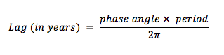
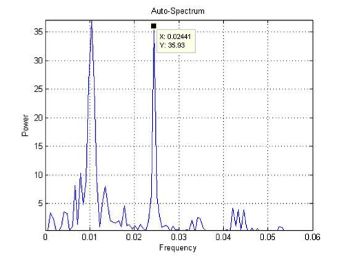
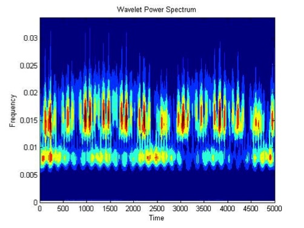
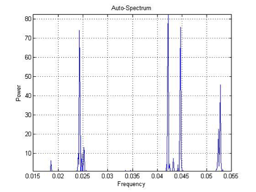
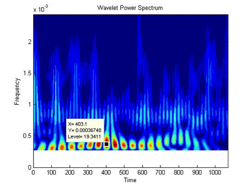
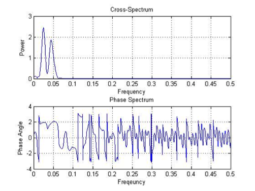

# Auto-spectral and Cross-spectral Analysis to Identify Milankovitch Periodicity in ∂18O Isotopes and Summer Insolation
## Introduction
For at least the last million years changes in global climate have been dominated by Milankovitch cycles. Milankovitch cycles are cycles in earth’s insolation due to changes in the shape of the Earth’s orbit, axial tilt, and precession of the equinoxes. These variations have periods of 100 ka, 41 ka, and 21-26 ka. Auoto-spectral analysis determines whether Milankovitch periodicity is present in foraminiferal ∂18O (a proxy for global ice volume) and calculated summer insolation at 65 N. Cross-spectral analysis of the two data records determines if and how they are related to each other. Data is from a private source and not available in this repository 
## Methods
Two separate MATLAB codes are created to calculate auto-spectral analysis and cross-spectral analysis. The auto-spectral analysis function determines periodicity of either the foraminiferal ∂18O data or the calculated insolation values, and has two options, ‘Blackman-Tukey’, and ‘wavelet’. The Blackman-Tukey option performs a Fourier transform. The Fourier transform matches sine waves to the data to determine periodicity. The wavelet option performs a wavelet transform. The wavelet transform matches Morlet mother waves to the data, and is useful to determine how persistent through time a trend is. The second function compares the two series and produces a cross-spectrum analysis and phase spectrum. The cross-spectrum analysis determines if there is relationship between insolation data and foraminifera data. The phase spectrum is used to determine lag time between events in one showing in the other. Lag time is calculated in years using the equation below.

## Results
### Auto-spectral Analysis
#### Foraminiferal ∂18O 

The Fourier transform yield two significant frequency peaks as shown above. The frequency peaks are 0.01 and 0.024; they correspond to periods of 100 and 40 ka respectively. The wavelet power spectrum shown below shows significant periodicity at a frequency of about 0.4 x 10-3 yr-1 corresponding to 2,500 ka period. 

#### Calculated Insolation Values 

The Fourier transform yields three significant frequency peaks as shown above. The frequency peaks are roughly 0.024, 0.042, and 0.45, they correspond to periods of roughly 40 and 23 and 22 ka respectively. The wavelet power spectrum shown below shows significant periodicities at frequencies of about 0.15 and 0.008 yr-1 corresponding to 66.67 and 125 ka period.

### Cross Spectral Analysis

Cross-spectral analysis and the phase spectrum are plotted above. The cross-spectral analysis determined that frequencies common to both data sets. The frequencies common to both data sets are 0.025 and 0.04. Both data sets therefore have periodicities of 40 ka and 20 ka. The phase angle of 1.92 corresponds to the 0.025 frequencies and the phase angle of 2.08 to 0.04. Lag times between the two data sets are calculated to be 12 ka for the 40 ka cycle and 6.6 ka for the 20 ka cycle. 
## Conclusions
Milankovitch cycles have periods of 100 ka, 41 ka, and 21-26 ka. The Blackman-Tukey autospectral analysis of the calculated insolation data detected the 40 ka and 20 ka Milankovitch periods recorded in the record. The wavelet auto-spectral analysis did not detect Milankovitch periods in the record. The Blackman-Tukey auto-spectral analysis of the foraminiferal ∂18O data detected the 100 ka and 40 ka Milankovitch periods recorded in the record. The wavelet auto-spectral analysis did not detect Milankovitch periods in the record. The cross-spectral analysis determined that the data sets exhibit the 40 ka and 20 ka Milankovitch cycles. The phase angle and lag time determined that changes in 40 ka insolation cycle appear 12 ka later in the foraminiferal ∂18O data, and that changes in the 20 ka insolation cycle appear 6.6 ka later in the foraminiferal ∂18O data. 
